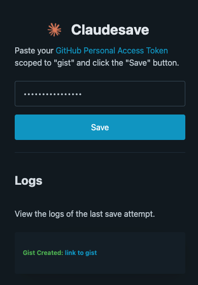
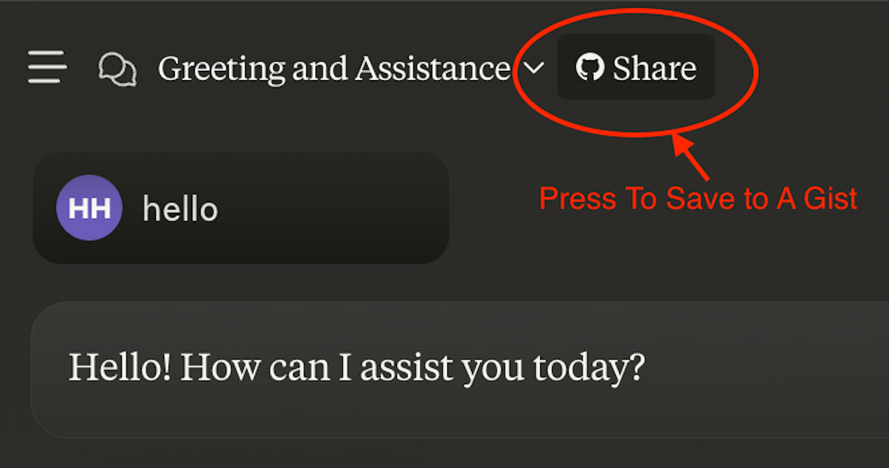

# ClaudeSave

> A Chrome extension that saves conversations with Claude to gists.

## Usage

### Step 1: Obtain a PAT

Obtain a [personal access token (PAT)](https://docs.github.com/en/authentication/keeping-your-account-and-data-secure/managing-your-personal-access-tokens#creating-a-personal-access-token-classic) with the `gist` scope.

### Step 1: Save your PAT
After installing the extension, you can click the extension icon to save your PAT.

> 

### Step 2: Save your conversation

When you are ready to save your conversation, click on the share button with the github icon.

> 

If you have saved your PAT correctly, a new tab will open with a gist containing your conversation.  You can inspect the logs by clicking on the extension icon and scrolling down to logs to check if there are any issues with your PAT.
